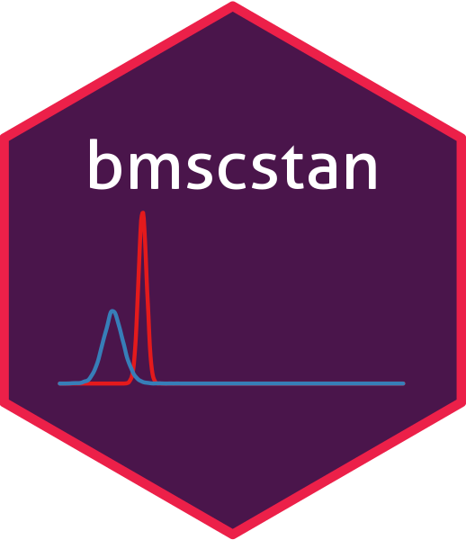

<!-- README.md is generated from README.Rmd. Please edit that file -->

# bmscstan 

<!--
-->

------------------------------------------------------------------------

Bayesian Multilevel Single Case models using ‘Stan’

This package allows to fit within the Bayesian Framework single case and
controls data, with the flexibility of Multilevel Models.

Works in R and it needs Stan.

More details in the help page.
